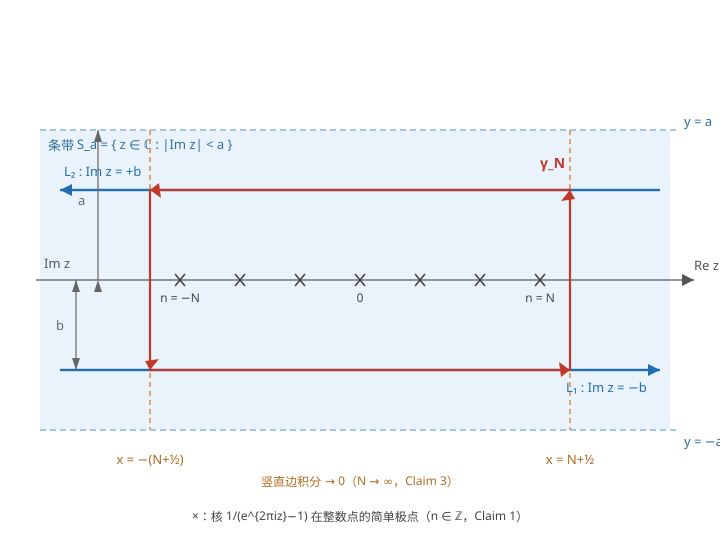

# Poisson 求和公式

> **工作空间**：实直线 $\mathbb{R}$。Stein 在 Ch.5 §3 给出本定理的 $\mathbb{R}$ 形式；推广到 $\mathbb{R}^d$ 见 Ch.6。

## What — 陈述

> 设 $f \in$ [[schwartz-space|Schwartz 空间]] $\mathcal{S}(\mathbb{R})$（Schwartz 类函数），则
> $$
> \sum_{n \in \mathbb{Z}} f(n) = \sum_{n \in \mathbb{Z}} \hat{f}(n),
> $$
> 其中 Fourier 变换采用 Stein 约定：$\hat{f}(\xi) = \int_{\mathbb{R}} f(x)\,e^{-2\pi i \xi x}\,dx$（**无 $2\pi$ 因子**）。

依据 [[steinFourierAnalysisIntroduction2003a|Stein & Shakarchi (2003), Ch. 5, Theorem 3.1]]。

### 前提条件

- $f$ 为 [[schwartz-space|Schwartz 类函数]]（$C^\infty$ 且所有导数多项式衰减）。
- Stein 的证明将公式理解为两种"周期化方式"的等价性。

### 典型例子

1. **Gauss 函数**：$f(x) = e^{-\pi s x^2}$（$s>0$）。$\hat{f}(\xi) = s^{-1/2} e^{-\pi \xi^2/s}$。代入 Poisson 求和得 theta 函数方程：$\vartheta(s) = s^{-1/2}\vartheta(1/s)$，其中 $\vartheta(s) = \sum_{n\in\mathbb{Z}} e^{-\pi n^2 s}$。这是 Riemann zeta 函数函数方程的核心。

2. **热核**：$f(x) = H_t(x) = \frac{1}{(4\pi t)^{1/2}} e^{-x^2/4t}$。$\hat{f}(\xi) = e^{-4\pi^2 \xi^2 t}$。Poisson 求和给出 $\mathbb{R}$ 上热核的周期化 = 圆上热核的 Fourier 展开：$\sum_n H_t(x+n) = \sum_n e^{-4\pi^2 n^2 t} e^{2\pi i n x}$。

3. **Poisson 核**：$f(x) = P_y(x) = \frac{1}{\pi}\frac{y}{x^2+y^2}$。$\hat{f}(\xi) = e^{-2\pi y |\xi|}$。Poisson 求和给出 Poisson 核的周期化：$\sum_n P_y(x+n) = \frac{1}{2\pi}\sum_n e^{-2\pi y |n|} e^{2\pi i n x} = P_r(2\pi x)$（$r = e^{-2\pi y}$）。

## Why — 动机与证明思路

### 动机

Poisson 求和公式连接了函数的逐点值与 [[fourier-coefficient|Fourier 系数]]的和。核心洞察：**两种「周期化」方式殊途同归**——将 $f$ 沿 $\mathbb{Z}$ 周期化得到 $F_1(x) = \sum_n f(x+n)$；将 $\hat{f}$ 的 Fourier 级数展开得到 $F_2(x) = \sum_n \hat{f}(n) e^{2\pi i n x}$。二者相等，在 $x=0$ 处取值即得公式。

### 证明思路（Stein 原表述）

定义两种将 $f$「折叠」到圆上的方法：

$$
F_1(x) = \sum_{n \in \mathbb{Z}} f(x + n),\qquad F_2(x) = \sum_{n \in \mathbb{Z}} \hat{f}(n)\,e^{2\pi i n x}.
$$

Stein 称两种方法「殊途同归」（"two approaches lead to the same function"）。证明方法：比较 $F_1$ 与 $F_2$ 的 Fourier 系数。

1. **第一步**：计算 $F_2$ 的 Fourier 系数——由 Fourier 级数系数的唯一性，第 $m$ 个 Fourier 系数为 $\hat{f}(m)$（因为 $F_2$ 已经是 Fourier 级数形式）。

2. **第二步**：计算 $F_1$ 的 Fourier 系数——
   $$
   \int_0^1 \sum_n f(x + n)\,e^{-2\pi i m x}\,dx = \sum_n \int_n^{n+1} f(y)\,e^{-2\pi i m y}\,dy = \hat{f}(m).
   $$
   关键：交换积分与求和的次序（由 Schwartz 衰减性保证绝对收敛）。

3. **第三步**：由 Fourier 系数的唯一性（Ch. 2, Theorem 2.1），$F_1 = F_2$。在 $x=0$ 处取值即得公式。

### 关键步骤说明

证明的核心是第二步中的积分与求和交换——这依赖于 Schwartz 类的快速衰减（$|f(x)| = O(|x|^{-N})$ 对所有 $N$ 成立）。若 $f$ 仅属于 [[lp-space|$L^1$]]，交换次序不保证，Poisson 求和公式可能失效——这就是条件不可削弱为 $L^1$ 的原因。

### 详细证明

#### 证明动机

证明的核心洞察是「两种周期化方式殊途同归」：将 $f$ 沿 $\mathbb{Z}$ 平移求和得到 $F_1$，将 $\hat{f}$ 在整数处的值作 Fourier 级数得到 $F_2$。若能证明 $F_1$ 与 $F_2$ 具有相同的 Fourier 系数，则由 Fourier 系数的唯一性（[[steinFourierAnalysisIntroduction2003a|Stein, Ch. 2, Theorem 2.1]]）得 $F_1 = F_2$。$F_2$ 的 Fourier 系数由定义直接读出；$F_1$ 的 Fourier 系数需要交换积分与求和次序——此交换的合法性依赖 $f \in \mathcal{S}(\mathbb{R})$ 的快速衰减性。

#### 详细证明

**第一阶段：构造周期化函数**。

定义两种将 $f$「折叠」到圆群 $[0, 1)$ 上的函数：
$$
F_1(x) = \sum_{n \in \mathbb{Z}} f(x + n), \qquad F_2(x) = \sum_{n \in \mathbb{Z}} \hat{f}(n)\, e^{2\pi i n x}.
$$

**Claim 1**（$F_1$ 与 $F_2$ 的良定义性）. 设 $f \in$ [[schwartz-space|Schwartz 空间]] $\mathcal{S}(\mathbb{R})$，则 $F_1$ 与 $F_2$ 在 $[0, 1]$ 上绝对一致收敛，从而为 $[0, 1]$ 上的连续函数。

*证明.* 由 [[schwartz-space|Schwartz 空间]]的定义，对任意 $N \geq 1$，存在常数 $C_N$ 使得 $|f(x)| \leq C_N (1 + |x|)^{-N}$。从而
$$
\sum_{n \in \mathbb{Z}} |f(x + n)| \leq C_N \sum_{n \in \mathbb{Z}} (1 + |x + n|)^{-N} \leq C_N \sum_{n \in \mathbb{Z}} (1 + |n| - 1)^{-N},
$$
其中最后一步因 $x \in [0, 1]$ 故 $|x + n| \geq |n| - 1$。取 $N \geq 2$，级数 $\sum_n (1 + |n|)^{-N}$ 收敛，故 $F_1$ 绝对一致收敛。

对于 $F_2$，因 $f \in \mathcal{S}(\mathbb{R})$，$\hat{f} \in \mathcal{S}(\mathbb{R})$（[[steinFourierAnalysisIntroduction2003a|Stein, Ch. 5, Theorem 1.13]]，Fourier 变换是 $\mathcal{S}$ 上的自同构），故 $|\hat{f}(n)| \leq C'_N (1 + |n|)^{-N}$。取 $N \geq 2$，$\sum_n |\hat{f}(n)|$ 收敛，$F_2$ 绝对一致收敛。$\blacksquare$

**第二阶段：计算 $F_2$ 的 Fourier 系数**。

$F_2(x) = \sum_{n \in \mathbb{Z}} \hat{f}(n)\, e^{2\pi i n x}$ 已为 Fourier 级数形式。由 Fourier 级数系数的唯一性，$F_2$ 的第 $m$ 个 Fourier 系数为
$$
\int_0^1 F_2(x)\, e^{-2\pi i m x}\, dx = \hat{f}(m), \qquad m \in \mathbb{Z},
$$
此为 Fourier 级数正交性的直接应用：$\int_0^1 e^{2\pi i n x} e^{-2\pi i m x}\, dx = \delta_{nm}$。

**第三阶段：计算 $F_1$ 的 Fourier 系数**。

$F_1$ 的第 $m$ 个 Fourier 系数为
$$
\int_0^1 F_1(x)\, e^{-2\pi i m x}\, dx = \int_0^1 \sum_{n \in \mathbb{Z}} f(x + n)\, e^{-2\pi i m x}\, dx. \tag{$*$}
$$

此处须交换积分与求和的次序。此步骤在 Stein 原文中以「由 Schwarz 衰减性保证绝对收敛」概括，须提取为技术性 Claim。

**Claim 2**（积分与求和的可交换性）. 设 $f \in$ [[schwartz-space|Schwartz 空间]] $\mathcal{S}(\mathbb{R})$，则
$$
\int_0^1 \sum_{n \in \mathbb{Z}} f(x + n)\, e^{-2\pi i m x}\, dx = \sum_{n \in \mathbb{Z}} \int_0^1 f(x + n)\, e^{-2\pi i m x}\, dx.
$$

*证明.* 由 [[schwartz-space|Schwartz 空间]]的定义，对任意 $N \geq 1$，存在常数 $C_N$ 使得 $|f(x)| \leq C_N (1 + |x|)^{-N}$。从而
$$
\sum_{n \in \mathbb{Z}} \int_0^1 |f(x + n)| \cdot |e^{-2\pi i m x}|\, dx \leq \sum_{n \in \mathbb{Z}} \int_0^1 C_N (1 + |x + n|)^{-N}\, dx,
$$
其中用到 $|e^{-2\pi i m x}| = 1$。因 $x \in [0, 1]$，有 $|x + n| \geq |n| - 1$，故
$$
\sum_{n \in \mathbb{Z}} \int_0^1 C_N (1 + |x + n|)^{-N}\, dx \leq C_N \sum_{n \in \mathbb{Z}} (1 + |n| - 1)^{-N} = C_N \sum_{n \in \mathbb{Z}} |n|^{-N}.
$$
取 $N \geq 2$，右端级数收敛。由 Fubini 定理（控制收敛判据），$(*)$ 中的积分与求和可交换。$\blacksquare$

由 Claim 2，交换 $(*)$ 中的次序并作变量替换 $y = x + n$（从而 $dy = dx$，$x = y - n$）：
$$
\sum_{n \in \mathbb{Z}} \int_0^1 f(x + n)\, e^{-2\pi i m x}\, dx = \sum_{n \in \mathbb{Z}} \int_n^{n+1} f(y)\, e^{-2\pi i m (y - n)}\, dy.
$$
因 $e^{-2\pi i m (y - n)} = e^{-2\pi i m y} \cdot e^{2\pi i m n} = e^{-2\pi i m y}$（$m, n \in \mathbb{Z}$，由 [[integer-periodicity-of-exponential|$e^{2\pi i m n} = 1$]]），上式化为
$$
\sum_{n \in \mathbb{Z}} \int_n^{n+1} f(y)\, e^{-2\pi i m y}\, dy = \int_{\mathbb{R}} f(y)\, e^{-2\pi i m y}\, dy = \hat{f}(m),
$$
其中第二个等号因为区间 $[n, n+1)$（$n \in \mathbb{Z}$）铺满 $\mathbb{R}$，第三个等号为 Fourier 变换的定义。因此 $F_1$ 的第 $m$ 个 Fourier 系数亦为 $\hat{f}(m)$。

**第四阶段：由唯一性定理得 $F_1 = F_2$**。

由第二阶段与第三阶段，$F_1$ 与 $F_2$ 的所有 Fourier 系数均相等：$\hat{F}_1(m) = \hat{f}(m) = \hat{F}_2(m)$（$m \in \mathbb{Z}$）。由 Claim 1，$F_1$ 与 $F_2$ 均为 $[0, 1]$ 上的连续函数。由 Fourier 系数的唯一性定理（[[steinFourierAnalysisIntroduction2003a|Stein, Ch. 2, Theorem 2.1]]：若连续函数的所有 Fourier 系数为零，则函数恒为零），$F_1 - F_2$ 的所有 Fourier 系数为零，故 $F_1 = F_2$。

在 $x = 0$ 处取值，得
$$
\sum_{n \in \mathbb{Z}} f(n) = F_1(0) = F_2(0) = \sum_{n \in \mathbb{Z}} \hat{f}(n). \qquad \blacksquare
$$

> **依赖关系小结**: 本证明依赖链为「[[schwartz-space|Schwartz 空间]]（快速衰减：Claim 1 保证 $F_1$、$F_2$ 绝对一致收敛；Claim 2 保证积分–求和交换的绝对可积）⇒ Stein Ch. 5 Theorem 1.13（Fourier 变换是 $\mathcal{S}$ 上的自同构，$\hat f \in \mathcal{S}$）⇒ [[fubini-tonelli|Fubini 定理]]（Claim 2）⇒ [[integer-periodicity-of-exponential|复指数的整数周期性]]（$e^{2\pi i mn} = 1$）⇒ Fourier 系数唯一性定理（Stein Ch. 2 Theorem 2.1，$F_1$ 与 $F_2$ 系数相等故 $F_1 = F_2$）⇒ Poisson 求和」。各阶段均前向依赖，未引用本页自身；详细证明实际只用 Fourier 系数唯一性与变换定义，未调用 [[fourier-inversion|Fourier 反演定理]]（关联区所述依赖在正文中由系数唯一性取代）。依赖图无环。

## 其他证明

> 本区段按 docs/PROOFS.md §6.5 记录与主证明不同的第二证法;主证明(§「详细证明」,Book I 的周期化–Fourier 系数比较法)保持不变。

#### 证明二:复分析(留数核)法

**来源与录入**。本证法为 Stein《Complex Analysis》(Book II)书内证明([[steinComplexAnalysis|Stein & Shakarchi (2003), Ch. 4, Theorem 2.4, p.137-138]]);录入日期:2026-08-13;书内证明。

**工作空间声明**。本证明的工作空间是 Book II 的函数类
$$
\mathscr{F}_a = \big\{f : f \text{ 在条带 } S_a = \{z \in \mathbb{C} : |\operatorname{Im} z| < a\} \text{ 上全纯, 且 } |f(x+iy)| \le \frac{A}{1+x^2},\ \forall x \in \mathbb{R},\ |y| < a\big\},
$$
即「条带全纯 + 中等衰减」类(解析条件强于 [[schwartz-space|Schwartz 类]]、衰减条件弱于 Schwartz 类)。Fourier 变换取 Stein 约定 $\hat{f}(\xi) = \int_{\mathbb{R}} f(x)\,e^{-2\pi i x\xi}\,dx$(实直线 $\mathbb{R}$ 情形,非圆群);核 $e^{2\pi i z}$ 为书中复数记号,予以保留。

**陈述（$\mathscr{F}_a$ 工作空间版本）**。工作空间由主定理的 $\mathcal{S}(\mathbb{R})$ 换为 $\mathscr{F}_a$,按项目规则须重新叙述定理:设 $f \in \mathscr{F}_a$([[f_a-class|F_a 类]],条件:条带全纯 + 中等衰减),则
$$
\sum_{n \in \mathbb{Z}} f(n) = \sum_{n \in \mathbb{Z}} \hat{f}(n),
$$
其中 Fourier 变换取上文 Stein 约定。此为 [[steinComplexAnalysis|Stein & Shakarchi (2003), Ch. 4, Theorem 2.4, p.137]]。两端级数均绝对收敛:左端因 $|f(n)| \le A/(1+n^2)$(衰减条件取 $y = 0$);右端因 $\hat f$ 的指数衰减 $|\hat f(\xi)| \le B e^{-2\pi b|\xi|}$($0 \le b < a$,[[f_a-class|F_a 类]] §基本性质 3)。

**动机**。主证明(Book I,Ch.5 §3)用「周期化 + Fourier 系数比较」在 $\mathcal{S}(\mathbb{R})$ 上证 Poisson 求和。本证明(Book II,Ch.4)换用[[contour-integration|围道积分]]:对被积函数 $f(z)/(e^{2\pi i z}-1)$ 在矩形围道上应用 [[residue-theorem|留数定理]]。关键观察是,$e^{2\pi i z}$ 以 $1$ 为周期且 $e^{2\pi i n} = 1$($n \in \mathbb{Z}$),故核 $1/(e^{2\pi i z}-1)$ 恰在整数处有简单极点、留数 $1/2\pi i$——围道内留数和直接给出 $\sum_{n\in\mathbb{Z}}f(n)$;再对核作几何级数展开并作围道平移回实轴,留数和又给出 $\sum_{n\in\mathbb{Z}}\hat{f}(n)$。此法把 Poisson 求和从 Schwartz 类推广到「条带全纯 + 中等衰减」类 $\mathscr{F}_a$,是 Book I 结果的**更强版本**——呼应「一种方法(围道积分)证明更强结论」。

**证明思路**。

1. **极点与留数**:确定核 $1/(e^{2\pi i z}-1)$ 的极点与留数。
2. **矩形围道**:对顶点 $(N+\frac12) \pm ib$、$-(N+\frac12) \pm ib$ 的矩形 $\gamma_N$ 用留数定理,得 $\sum_{|n|\le N} f(n) = \int_{\gamma_N}\frac{f(z)}{e^{2\pi i z}-1}\,dz$。
3. **取极限**:$N \to \infty$ 时竖直边积分消失、部分和收敛,得 $\sum_{n\in\mathbb{Z}}f(n) = \int_{L_1}\frac{f(z)}{e^{2\pi i z}-1}\,dz - \int_{L_2}\frac{f(z)}{e^{2\pi i z}-1}\,dz$。
4. **几何级数展开 + 围道平移**:在 $L_1$ 上 $|e^{2\pi i z}| > 1$、在 $L_2$ 上 $|e^{2\pi i z}| < 1$,分别展开核,逐项积分并移回实轴,得 $\sum_{n\ge0}\hat{f}(n+1) + \sum_{n\ge0}\hat{f}(-n) = \sum_{n\in\mathbb{Z}}\hat{f}(n)$。

**围道示意图**。

> **图 1**:围道 $\gamma_N$(红色矩形,逆时针)与条带 $S_a$(浅蓝区域)。水平边 $L_1, L_2$ 位于 $\operatorname{Im} z = \pm b$($0 < b < a$);竖直边位于 $x = \pm (N+\frac12)$(虚线),其上的积分随 $N \to \infty$ 趋于零(Claim 3),故围道积分退化为 $\int_{L_1} - \int_{L_2}$,即公式 (2)。× 处为核 $1/(e^{2\pi i z}-1)$ 在整数点的简单极点(Claim 1);由留数定理,$\int_{\gamma_N} = \sum_{|n|\le N} f(n)$(Claim 2)。

**详细证明**。

**Claim 1**(核 $1/(e^{2\pi i z}-1)$ 的极点与留数). 函数 $h(z) = 1/(e^{2\pi i z}-1)$ 恰在整数点 $z = n \in \mathbb{Z}$ 有简单极点,且 $\operatorname{Res}(h, n) = \frac{1}{2\pi i}$。若 $f \in \mathscr{F}_a$,则 $f(z)/(e^{2\pi i z}-1)$ 在 $z = n$ 的留数为 $f(n)/2\pi i$。

*证明.* $z \mapsto e^{2\pi i z}$ 为整函数且以 $1$ 为周期,故 $e^{2\pi i z} - 1 = 0$ 当且仅当 $z \in \mathbb{Z}$。固定 $n \in \mathbb{Z}$,由泰勒展开 $e^{w} = 1 + w + O(w^2)$($w \to 0$)与 $e^{2\pi i n} = 1$,
$$e^{2\pi i z} - 1 = e^{2\pi i n}\,e^{2\pi i (z-n)} - 1 = e^{2\pi i (z-n)} - 1 = 2\pi i (z-n) + O\big((z-n)^2\big).$$
因此 $z = n$ 是 $e^{2\pi i z}-1$ 的单零点,$h$ 在该处有简单极点,且
$$h(z) = \frac{1}{2\pi i(z-n) + O((z-n)^2)} = \frac{1}{2\pi i(z-n)}\cdot\frac{1}{1 + O(z-n)},$$
其洛朗展开的主部为 $\frac{1}{2\pi i(z-n)}$,故 $\operatorname{Res}(h, n) = \frac{1}{2\pi i}$。因 $n \in \mathbb{R} \subset S_a$,$f$ 在 $n$ 附近全纯,故 $f(z)/(e^{2\pi i z}-1)$ 在 $z = n$ 的留数为 $f(n)\operatorname{Res}(h, n) = \frac{f(n)}{2\pi i}$。$\blacksquare$

**Claim 2**(矩形围道). 固定 $0 < b < a$ 与整数 $N \ge 1$。设 $\gamma_N$ 为顶点 $(N+\frac12) \pm ib$、$-(N+\frac12) \pm ib$ 的矩形围道,取逆时针方向。则
$$
\sum_{|n| \le N} f(n) = \int_{\gamma_N}\frac{f(z)}{e^{2\pi i z} - 1}\,dz. \tag{1}
$$

*证明.* 竖直边位于直线 $x = \pm(N + \frac12)$,其上不含整数;水平边位于 $\operatorname{Im} z = \pm b \ne 0$,亦无奇点。故由 Claim 1,被积函数在 $\gamma_N$ 上全纯(除围道内整数点),且围道内的唯一奇点为满足 $|n| \le N$ 的整数 $n$,均为简单极点。由 [[residue-theorem|留数定理]](Ch.3 Corollary 2.3,toy contour 版本)与 Claim 1,
$$\int_{\gamma_N}\frac{f(z)}{e^{2\pi i z}-1}\,dz = 2\pi i \sum_{|n|\le N}\operatorname{Res}\left(\frac{f(z)}{e^{2\pi i z}-1},\, n\right) = 2\pi i\sum_{|n|\le N}\frac{f(n)}{2\pi i} = \sum_{|n|\le N}f(n). \qquad\blacksquare$$

**Claim 3**(极限与竖直边消失). 设 $N \to \infty$,则 (i) $\sum_{|n|\le N} f(n) \to \sum_{n\in\mathbb{Z}} f(n)$;(ii) $\gamma_N$ 两条竖直边上的积分趋于零。于是
$$
\sum_{n\in\mathbb{Z}} f(n) = \int_{L_1}\frac{f(z)}{e^{2\pi i z}-1}\,dz - \int_{L_2}\frac{f(z)}{e^{2\pi i z}-1}\,dz, \tag{2}
$$
其中 $L_1 = \{u - ib : u \in \mathbb{R}\}$、$L_2 = \{u + ib : u \in \mathbb{R}\}$ 均自左至右。

*证明.* (i) 由 $\mathscr{F}_a$ 的衰减条件(取 $y = 0$),$|f(n)| \le A/(1+n^2)$,级数 $\sum_n |f(n)|$ 收敛,故部分和收敛到 $\sum_n f(n)$。(ii) 在右边 $z = N + \frac12 + iy$($y \in [-b,b]$)上,$|e^{2\pi i z}| = e^{-2\pi y} \in [e^{-2\pi b},\, e^{2\pi b}]$,故
$$|e^{2\pi i z} - 1| \ge \big|\,|e^{2\pi i z}| - 1\big| \ge 1 - e^{-2\pi b} > 0,$$
且 $|f(z)| \le A/\big(1 + (N+\frac12)^2\big)$;该边长为 $2b$,积分之模不超过 $\frac{2bA}{(1 + (N+\frac12)^2)(1 - e^{-2\pi b})} \to 0$。左边同理。由于 $\gamma_N$ 取逆时针方向,底边(在 $L_1$ 上)自左至右、顶边(在 $L_2$ 上)自右至左,对 (1) 取极限即得 (2)。$\blacksquare$

**Claim 4**(几何级数展开). 若 $|w| > 1$,则 $\frac{1}{w-1} = w^{-1}\sum_{n\ge0}w^{-n}$;若 $|w| < 1$,则 $\frac{1}{w-1} = -\sum_{n\ge0}w^{n}$。

*证明.* 对 $|w| > 1$,几何级数 $\sum_{n\ge0}w^{-n} = \frac{1}{1 - w^{-1}} = \frac{w}{w-1}$,两边乘以 $w^{-1}$ 即得第一条;对 $|w| < 1$,$\sum_{n\ge0}w^n = \frac{1}{1-w} = -\frac{1}{w-1}$,即第二条。$\blacksquare$

应用 Claim 4:在 $L_1$ 上 $z = u - ib$,有 $|e^{2\pi i z}| = e^{2\pi b} > 1$,故
$$\frac{1}{e^{2\pi i z}-1} = e^{-2\pi i z}\sum_{n\ge0}e^{-2\pi i n z} \qquad (z \in L_1);$$
在 $L_2$ 上 $z = u + ib$,有 $|e^{2\pi i z}| = e^{-2\pi b} < 1$,故
$$\frac{1}{e^{2\pi i z}-1} = -\sum_{n\ge0}e^{2\pi i n z} \qquad (z \in L_2).$$

**Claim 5**(逐项积分与围道平移回实轴). (i) 在 $L_1$ 上,级数 $\sum_{n\ge0}\int_{L_1}|f(z)\,e^{-2\pi i (n+1)z}|\,|dz|$ 收敛;在 $L_2$ 上,$\sum_{n\ge0}\int_{L_2}|f(z)\,e^{2\pi i n z}|\,|dz|$ 收敛,故 (2) 中积分可逐项积分。(ii) 对任意整数 $m$ 与水平线 $L_c = \{u + ic : u \in \mathbb{R}\}$($|c| < a$),
$$
\int_{L_c} f(z)\,e^{-2\pi i m z}\,dz = \int_{-\infty}^{\infty} f(x)\,e^{-2\pi i m x}\,dx. \tag{3}
$$

*证明.* (i) 在 $L_1$ 上,$z = u - ib$,故 $|e^{-2\pi i (n+1)z}| = e^{-2\pi (n+1)b}$ 且 $|f(z)| \le A/(1+u^2)$。于是
$$\sum_{n\ge0}\int_{L_1}\big|f(z)\,e^{-2\pi i (n+1)z}\big|\,|dz| \le \sum_{n\ge0}e^{-2\pi (n+1)b}\int_{-\infty}^{\infty}\frac{A}{1+u^2}\,du = \pi A\cdot\frac{e^{-2\pi b}}{1 - e^{-2\pi b}} < \infty,$$
其中用到 $b > 0$ 使几何级数 $\sum_{n\ge0}e^{-2\pi (n+1)b}$ 收敛。$L_2$ 上 $|e^{2\pi i n z}| = e^{-2\pi b n}$,估计相同。此处适用的是 [[fubini-tonelli|Fubini 定理（控制收敛判据）]] 的**一致收敛版本**:上述估计给出,在 $L_1$ 上
$$
\sum_{n\ge0}\big|f(z)\,e^{-2\pi i(n+1)z}\big| \le \frac{A}{1+u^2}\sum_{n\ge0}e^{-2\pi (n+1)b},
$$
右端为收敛的常值级数,故级数 $\sum_{n\ge0}f(z)\,e^{-2\pi i(n+1)z}$ 在 $L_1$ 上按 Weierstrass M-判别法一致收敛;结合 $\sum_{n\ge0}\int_{L_1}\big|f(z)\,e^{-2\pi i(n+1)z}\big|\,|dz| < \infty$,满足 Fubini 控制收敛判据的假设,得 (2) 中积分与求和可交换。$f \in \mathscr{F}_a$ 仅保证中等衰减(非 Schwartz 速降),此处只能使用上述一致收敛版本,而非经典 [[dominated-convergence|控制收敛定理]] 的单测度陈述;$L_2$ 上的交换同理。

(ii) 函数 $z \mapsto f(z)e^{-2\pi i m z}$ 在 $S_a$ 内全纯。对 $L_c$ 与实轴之间的矩形(水平边在 $\operatorname{Im} z = 0$ 与 $\operatorname{Im} z = c$ 处)应用 [[cauchy-theorem|Cauchy 定理]];竖直边($z = \pm R + iy$,$y$ 介于 $0$ 与 $c$ 之间)上 $|f(z)| \le A/(1+R^2)$ 且 $|e^{-2\pi i m z}| = e^{2\pi m y}$ 有界,积分之模不超过 $O(1/R^2)$,取极限得 (3)。$\blacksquare$

**结论**。将 Claim 4 的展开代入 (2),并利用 Claim 5(i) 逐项积分:
$$
\sum_{n\in\mathbb{Z}} f(n) = \int_{L_1}f(z)\Big(e^{-2\pi i z}\sum_{n\ge0}e^{-2\pi i n z}\Big)dz + \int_{L_2}f(z)\Big(\sum_{n\ge0}e^{2\pi i n z}\Big)dz
$$
$$
= \sum_{n\ge0}\int_{L_1}f(z)\,e^{-2\pi i (n+1)z}\,dz + \sum_{n\ge0}\int_{L_2}f(z)\,e^{2\pi i n z}\,dz.
$$
对每一项应用 Claim 5(ii)($L_1$ 与 $L_2$ 均移回实轴),
$$
= \sum_{n\ge0}\int_{-\infty}^{\infty} f(x)\,e^{-2\pi i (n+1)x}\,dx + \sum_{n\ge0}\int_{-\infty}^{\infty} f(x)\,e^{2\pi i n x}\,dx.
$$
由 Fourier 变换的定义,第一项内层积分为 $\hat f(n+1)$,第二项内层积分为 $\hat f(-n)$(因 $e^{2\pi i n x} = e^{-2\pi i (-n) x}$)。故
$$
\sum_{n\in\mathbb{Z}} f(n) = \sum_{n\ge0}\hat{f}(n+1) + \sum_{n\ge0}\hat{f}(-n) = \sum_{m\in\mathbb{Z}}\hat{f}(m),
$$
其中最后一步:第一项覆盖 $m \ge 1$,第二项(含 $n = 0$ 项 $\hat f(0)$)覆盖 $m \le 0$。此即 Poisson 求和公式。$\blacksquare$

## What-if — 反例、等价叙述与推广

### 反例（条件不可削弱）

1. **$L^1$ 不足以保证 Poisson 求和**：$f(x) = e^{-|x|}$。$f \in L^1$，$\hat{f}(\xi) = \frac{2}{1+4\pi^2\xi^2}$。$\sum f(n) = 1 + 2\sum_{n=1}^\infty e^{-n} = \frac{e+1}{e-1}$（收敛），$\sum \hat{f}(n)$ 也收敛——但二者**不相等**。实际上 $\sum f(n) = \coth(1/2) \approx 2.163$，而 $\sum \hat{f}(n) = \frac{1}{\pi}\coth(1/2\pi) \approx 2.004$。原因是 $f \notin \mathcal{S}$（衰减仅为指数级，不是多项式级），交换积分与求和次序的论证不成立。

2. **条件 $f \in C^\infty$ 不足以保证 Poisson 求和**：$f(x) = \frac{1}{1+x^2}$。$f \in C^\infty$ 但衰减仅为 $O(|x|^{-2})$，$\hat{f}(\xi) = \pi e^{-2\pi|\xi|}$。$\sum f(n)$ 收敛（$\sim \sum 1/n^2$），$\sum \hat{f}(n)$ 也收敛，但二者不相等——$\hat{f}$ 的衰减为指数级，而 $f$ 的衰减仅为多项式级，不对称性导致 Poisson 求和失败。

### 等价叙述

#### 叙述 1（Stein 原始，$\mathbb{R}$ 形式）

> 在实直线 $\mathbb{R}$ 上，$f \in \mathcal{S}(\mathbb{R})$，则 $\sum_{n \in \mathbb{Z}} f(n) = \sum_{n \in \mathbb{Z}} \hat{f}(n)$（Ch.5, Theorem 3.1）。

#### 叙述 2（$\mathbb{R}^d$ 推广）

> 在 $\mathbb{R}^d$ 上，$f \in \mathcal{S}(\mathbb{R}^d)$，则 $\sum_{n \in \mathbb{Z}^d} f(n) = \sum_{n \in \mathbb{Z}^d} \hat{f}(n)$。

#### 叙述 3（局部紧阿贝尔群，抽象层）

> 对局部紧阿贝尔群 $G$ 及其闭子群 $H$（取 Haar 测度 $dg$、$dh$），
> $$
> \int_H f(g h)\,dh = \int_{H^\perp} \hat{f}(\xi)\,d\xi,
> $$
> 其中 $H^\perp = \{\xi \in \hat{G} : \chi_\xi(h) = 1, \forall h \in H\}$。

**等价关系**：叙述 1 ⊂ 叙述 2 ⊂ 叙述 3。叙述 3 是 Pontryagin 对偶语言下的最一般形式。

### 推广 / 变体

- **Theta 函数方程**（Theorem 3.2）：$\vartheta(s) = s^{-1/2}\vartheta(1/s)$，$s > 0$。应用于 Riemann zeta 函数的解析延拓与函数方程。
- **采样定理**（Ch. 5, Exercise 20）：若 $\hat{f}$ 支撑于 $[-1/2, 1/2]$，则 $f(x) = \sum_{n \in \mathbb{Z}} f(n)\,\frac{\sin\pi(x-n)}{\pi(x-n)}$。
- **群论诠释**：$\widehat{G/H} \cong H^\perp$——Poisson 求和公式是 Pontryagin 对偶在商群上的表现。

## 证明难度差异

### 叙述 1（$\mathbb{R}$ 形式）的证明

- **方法**：比较 Fourier 系数（Stein 原始方法）：构造 $F_1(x) = \sum_n f(x+n)$ 与 $F_2(x) = \sum_n \hat{f}(n) e^{2\pi i nx}$，由唯一性定理得 $F_1 = F_2$，代入 $x=0$。
- **难度**：**低**——只用 Schwartz 衰减性与重积分次序交换（Stein Ch.5 §3）。
- **代价**：仅在 $\mathbb{R}$ 上成立。

### 叙述 2（$\mathbb{R}^d$ 形式）的证明

- **方法**：类比叙述 1，应用多元 Fourier 系数比较。
- **难度**：**中**——需处理多元积分次序。
- **代价**：本质同叙述 1。

### 叙述 3（局部紧阿贝尔群）的证明

- **方法**：构造 Haar 测度下的自伴算子，应用谱定理。
- **难度**：**高**——需引入测度论、抽象调和分析、谱论。
- **结论**：可推广到任意局部紧阿贝尔群 $G$。

### 证明二（复分析留数核法）的证明

- **方法**：围道积分（[[residue-theorem|留数定理]] + [[contour-integration|围道平移]] + 几何级数展开），Book II Ch.4 Theorem 2.4。
- **难度**：**中**——需复分析工具（留数计算、Cauchy 定理、竖直边估计）与积分–求和交换。
- **代价**：条件放宽为 $\mathscr{F}_a$（条带全纯 + 中等衰减），比叙述 1 的 Schwartz 条件更弱、适用范围更广；证明相应更长，且不覆盖 $L^1$ 情形。

**总评**：叙述 1 证明简单但适用范围窄；叙述 3 证明复杂但适用范围广。证明难度与抽象程度的权衡是 Fourier 分析的核心张力之一。Stein 在 Ch.5 §3 选择叙述 1，是符合「初级阶段」教学目标的合理选择。

## 相关习题

- [[ch5-problem-1-psf-without-schwartz|Ch.5 Problem 1]]：$f,f'\in L^1$ 弱条件下 PSF 仍成立，是 Schwartz 版的条件弱化等价形式
- **Ch.5 Ex.15（余割平方和）**：对 $g(x) = 1/(x^2+\alpha^2)$ 型函数应用 PSF 得 $\sum_n\frac{1}{(n+\alpha)^2} = \frac{\pi^2}{\sin^2(\pi\alpha)}$；再积分得 $\sum_n\frac{1}{n+\alpha} = \frac{\pi}{\tan(\pi\alpha)}$（$\alpha$ 非整数，级数取对称主值）——与 [[euler-fourier-formulas|Euler 部分分式公式]] 的 Fourier 路线互补

## 应用

- 推导 zeta 函数与 theta 函数的联系（$\pi^{-s/2}\Gamma(s/2)\zeta(s) = \frac{1}{2}\int_0^\infty t^{s/2-1}(\vartheta(t)-1)\,dt$）。
- **采样定理**（Shannon-Nyquist）：带限信号的完美重建。
- **Selberg 迹公式**：Poisson 求和公式在非交换调和分析中的深远推广。

## 关联

- 概念：[[schwartz-space|Schwartz 空间]] $\mathcal{S}(\mathbb{R})$、[[good-kernel]]（离散化的"好核逼近"前身）、[[character|字符展开]]、[[f_a-class|$\mathscr{F}_a$ 类]]（证明二工作空间）、[[shift-of-line|水平线移位引理]]（证明二核心工具）
- 定理：[[fourier-inversion]]（反演链与 PSF 相互独立：PSF 主证明只用 Fourier 系数唯一性（Ch. 2 Thm 2.1），不调用反演定理，见「详细证明」依赖关系小结）、[[sampling-theorem]]（作为推论）
- 方法：[[approx-by-good-kernel]]（周期化是离散版好核逼近）、[[fubini-tonelli]]（积分与求和交换 —— Claim 2 关键）、[[residue-calculus]]（证明二围道积分法）
- 引理：[[integer-periodicity-of-exponential]]（Claim 2 中 $e^{2\pi i m n} = 1$）、[[residue-by-taylor-coeff]]（证明二 Claim 1 残部公式）
- 源：[[steinFourierAnalysisIntroduction2003a]]（Ch. 5, Theorem 3.1；Ch. 5 Exercise 20；Ch. 6 §3 推广）、[[steinComplexAnalysis]]（Ch. 4, Theorem 2.4）

### 此证明新引入 / 补充的 method

- **Fubini-Tonelli**（[[fubini-tonelli]]）：Claim 2「积分与求和可交换」的关键工具 — Schwartz 衰减性提供绝对收敛，Fubini 给出次序交换合法性。
- **好核逼近（离散版）**（[[approx-by-good-kernel]]）：Poisson 求和本质上是「Dirichlet 核平均 + Fourier 系数比较」的离散版好核构造。
- **积分截断**（[[integral-truncation]]）：theta 函数方程与 [[weyl-equidistribution|算术级数]]证明中的隐式截断思想。

## Stein 写法备注

Poisson 求和公式在 Stein 框架下的"两种周期化方式殊途同归"思想：$F_1(x) = \sum f(x+n)$（空间周期化）vs $F_2(x) = \sum \hat f(n) e^{2\pi i n x}$（频率 Fourier 级数）——核心 insight 是 **Schwartz 类封闭性 + Fourier 系数唯一性**。Stein 在 Ch. 5 §3 末尾还显式提及：「$\int f \bar g = \int \hat f \hat g$」即为 PSF 的代数诠释——此即 [[multiplication-formula-trick|Plancherel 证明]]中的乘法公式。

## 来源

- [[steinFourierAnalysisIntroduction2003a|Stein & Shakarchi (2003), 《Fourier Analysis: An Introduction》, Ch. 5, §3]]
- [[chat-fourier-series-2026-08-11|AI 对话笔记（已核验 B1–B4）]]